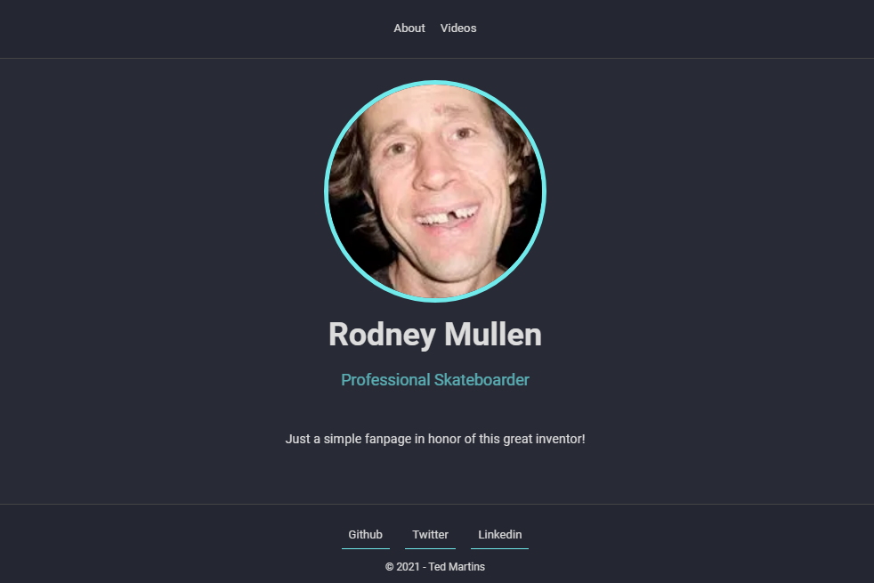
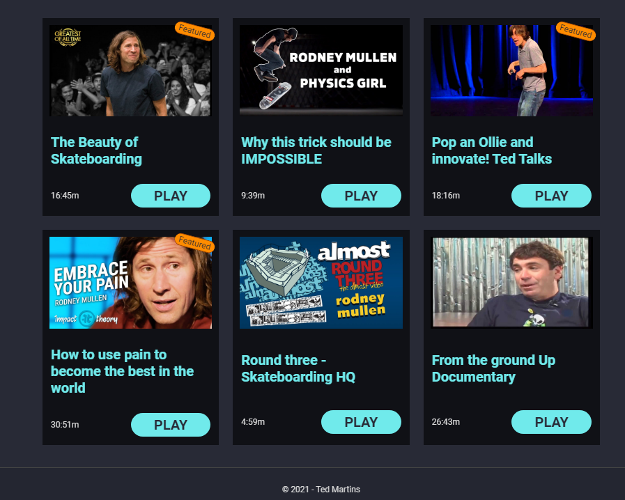
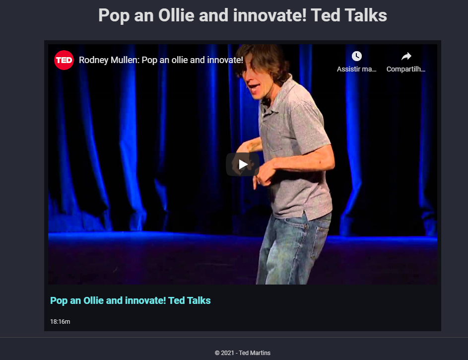

# Rodney Mullen Fan Page

<p align="center">

</p>

## About

For this project I used a Template Engine. It is a simple project done with educational purposes, with the single goal of improving my knowledge as a programmer.

## The Page

The page just show some videos of Rodney Mullen.

## How to run

You can clone this project to run it locally. After cloning, it may be necessary to install the dependencies:

### Node.JS:

v14.16.0 LTS, you can download it at [nodejs.org](https://nodejs.org)

With the Node.JS properly installed, you can run npm commands to install the other dependencies.


### Express:

```
npm install express
```
### Nunjucks:

```
npm install nunjucks
```

After installing the dependencies, just run the server and point your browser to it.

## Screenshots

<p align="center">

</p>

<p align="center">

</p>

